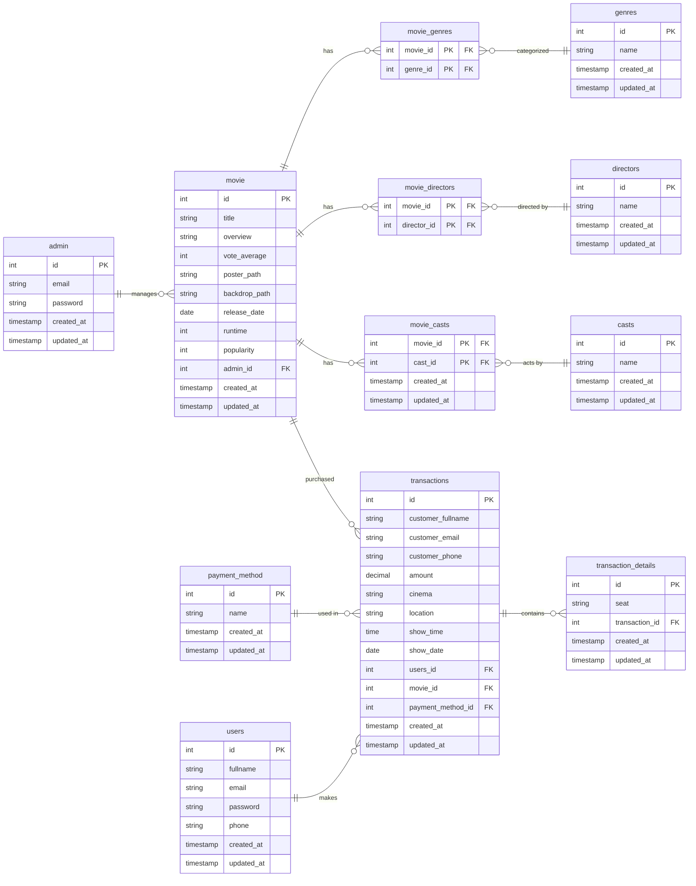

# Backend Cinevo: Movie Ticket Booking App

### ERD 

```mermaid
erDiagram
  direction LR

  admin ||--o{ movie : "manages"
  admin {
    int id PK
    string email
    string password
    timestamp created_at
    timestamp updated_at
  }

  movie ||--o{ movie_genres : "has"
  movie ||--o{ movie_directors : "has"
  movie ||--o{ movie_casts : "has"
  movie ||--o{ transactions : "purchased"
  movie {
    int id PK
    string title
    string overview
    int vote_average
    string poster_path
    string backdrop_path
    date release_date
    int runtime
    int popularity
    int admin_id FK
    timestamp created_at
    timestamp updated_at
  }

  genres {
    int id PK
    string name
    timestamp created_at
    timestamp updated_at
  }

  movie_genres }o--|| genres : "categorized"
  movie_genres {
    int movie_id PK "FK"
    int genre_id PK "FK"
  }

  directors {
    int id PK
    string name
    timestamp created_at
    timestamp updated_at
  }

  movie_directors }o--|| directors : "directed by"
  movie_directors {
    int movie_id PK "FK"
    int director_id PK "FK"
  }

  casts {
    int id PK
    string name
    timestamp created_at
    timestamp updated_at
  }

  movie_casts }o--|| casts : "acts by"
  movie_casts {
    int movie_id PK "FK"
    int cast_id PK "FK"
    timestamp created_at
    timestamp updated_at
  }

  transactions ||--o{ transaction_details : "contains"
  transaction_details {
    int id PK
    string seat
    int transaction_id FK
    timestamp created_at
    timestamp updated_at
  }

  payment_method ||--o{ transactions : "used in"
  payment_method {
    int id PK
    string name
    timestamp created_at
    timestamp updated_at
  }
 
  transactions {
    int id PK
    string customer_fullname
    string customer_email
    string customer_phone
    decimal amount
    string cinema
    string location
    time show_time
    date show_date
    int users_id FK
    int movie_id FK
    int payment_method_id FK
    timestamp created_at
    timestamp updated_at
  }

  users ||--o{ transactions : "makes"
  users {
    int id PK
    string fullname
    string email
    string password
    string phone
    timestamp created_at
    timestamp updated_at
  }

```