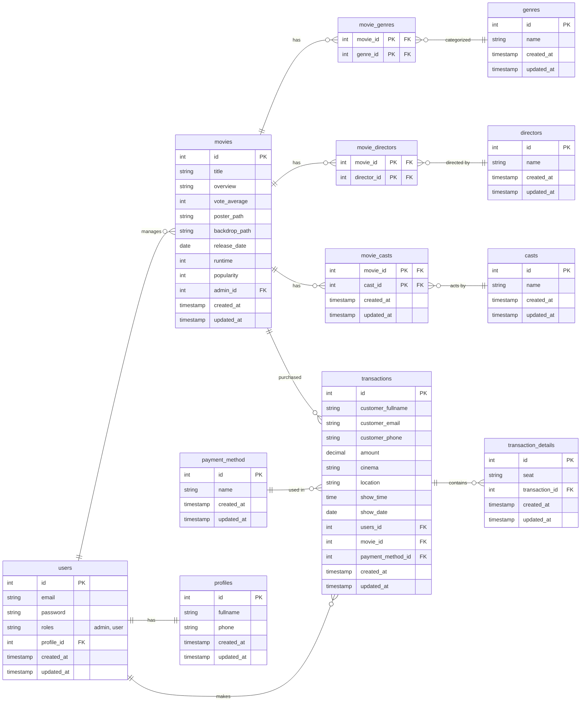

# Backend Cinevo: Movie Ticket Booking App

Cinevo is a backend service for a movie ticket booking application, built with Go and PostgreSQL designed to handle movie management, ticket booking, user authentication, and transaction history.

## API Endpoints Documentation

| Method | Endpoint                  | Description                |
|--------|---------------------------|----------------------------|
| POST   | /admin                    | Add a new movie            |
| GET    | /admin/sales-chart        | Get Sales Chart            |
| GET    | /admin/ticket-sales       | Get Ticket Sales           |
| DELETE | /admin/{id}               | Delete a movie             |
| PATCH  | /admin/{id}               | Update a movie             |
| GET    | /transactions             | Ticket Result              |
| POST   | /transactions             | Booking Tickets            |
| GET    | /transactions/history     | Transactions History       |
| GET    | /user                     | Get User Profile           |
| PATCH  | /user                     | Update User Profile        |
| POST   | /auth/forgot-password     | Forgot Password            |
| POST   | /auth/login               | Login a user               |
| POST   | /auth/register            | Register a new user        |
| POST   | /auth/reset-password      | Reset Password             |
| GET    | /movies                   | Get all movies             |
| GET    | /movies/now-showing       | Get now showing movies     |
| GET    | /movies/upcoming          | Get upcoming movies        |

## ERD (Entity Relationship Diagram)



## Installation

Follow these steps to set up the Cinevo backend locally:

1. **Clone the Repository**:
   ```bash
   git clone https://github.com/VsalCode/fgo24-be-tickitz.git
   cd fgo24-be-tickitz
   ```

2. **Install Dependencies**:
   ```bash
   go mod tidy
   ```

3. **Set Up Environment Variables**:
   Create a `.env` file in the project root and add the required environment variables (see [Environment Variables](#environment-variables)).

4. **Run the Application**:
   ```bash
   go run main.go
   ```

## Running Swagger

To view and interact with the API documentation using Swagger:

1. **Generate Swagger Documentation**:
   Generate the Swagger documentation:
   ```bash
   swag init
   ```

2. **Run the Application**:
   Start the application if not already running:
   ```bash
   go run main.go
   ```

3. **Access Swagger UI**:
   Open your browser and navigate to:
   ```
   http://localhost:8080/docs/index.html
   ```
   This assumes the application is running on the default port (8080). Adjust the port if your configuration differs.

## Environment Variables

Create a `.env` file in the project root with the following variables:

```env
PGUSER=your_postgres_username
PGPASSWORD=your_postgres_password
PGHOST=your_postgres_host
PGPORT=your_postgres_port
PGDATABASE=your_postgres_database

APP_SECRET=your_app_secret_key
APP_PASSWORD=your_app_password

REDIS_ADDR=localhost:6379
REDIS_PASSWORD=your_redis_password
```

Ensure these values are correctly configured for your PostgreSQL and Redis instances.

## Dependencies

The project relies on the following Go packages:
- [Gin Gonic](https://github.com/gin-gonic/gin) - Web framework
- [JWT v5](https://github.com/golang-jwt/jwt/v5) - JSON Web Token support
- [PGX](https://github.com/jackc/pgx/v5) - PostgreSQL driver
- [Godotenv](https://github.com/joho/godotenv) - Environment variable management
- [Go-Redis](https://github.com/redis/go-redis/v9) - Redis client
- [Bcrypt](https://golang.org/x/crypto/bcrypt) - Password hashing
- [Go-Swaggo](https://github.com/swaggo/swag) - API documentation
- [Go-Migrate](https://github.com/golang-migrate/migrate) - Database migrations

Install dependencies using:
```bash
go mod tidy
```

## How To Contribute
Pull requests are welcome! For major changes, please open an issue first to discuss your proposed changes. 

## License
This project is licensed under the [MIT](https://opensource.org/license/mit) License